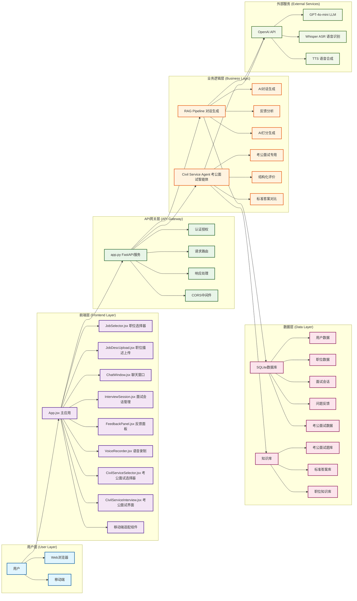
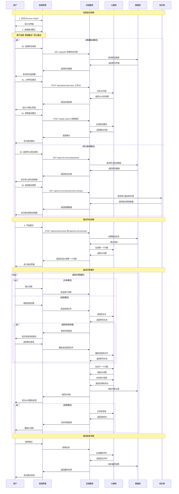
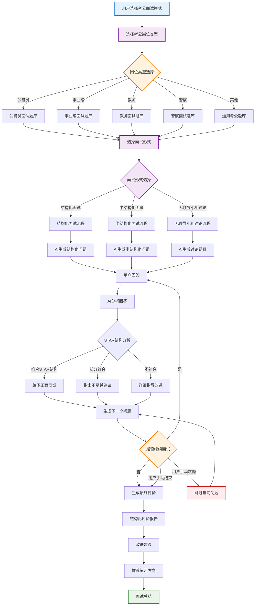
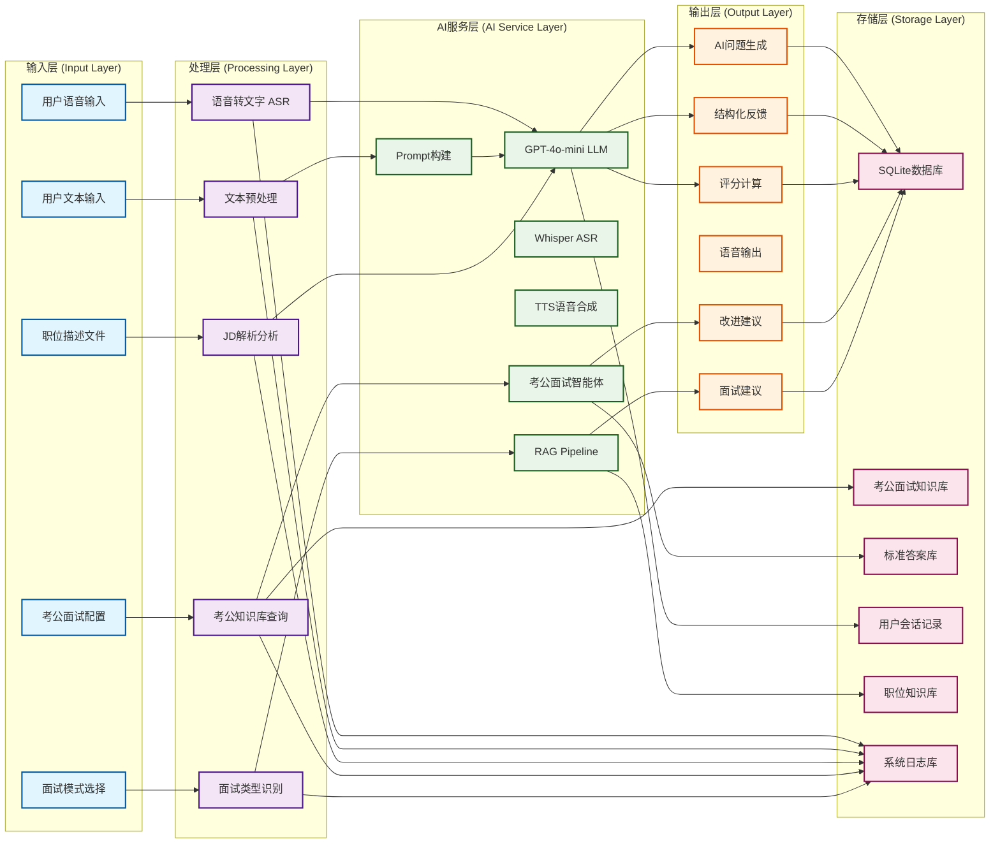
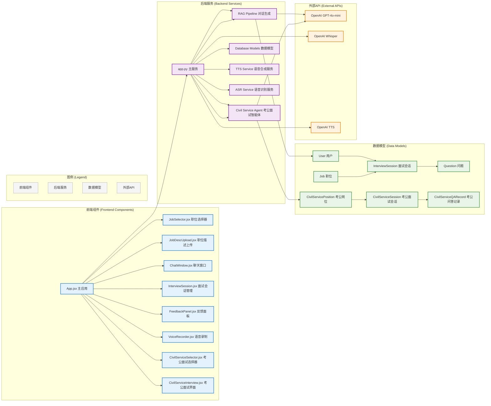
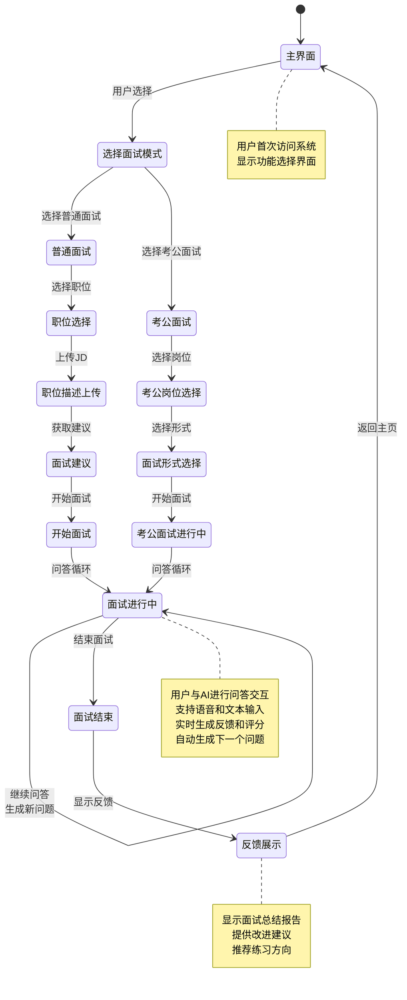
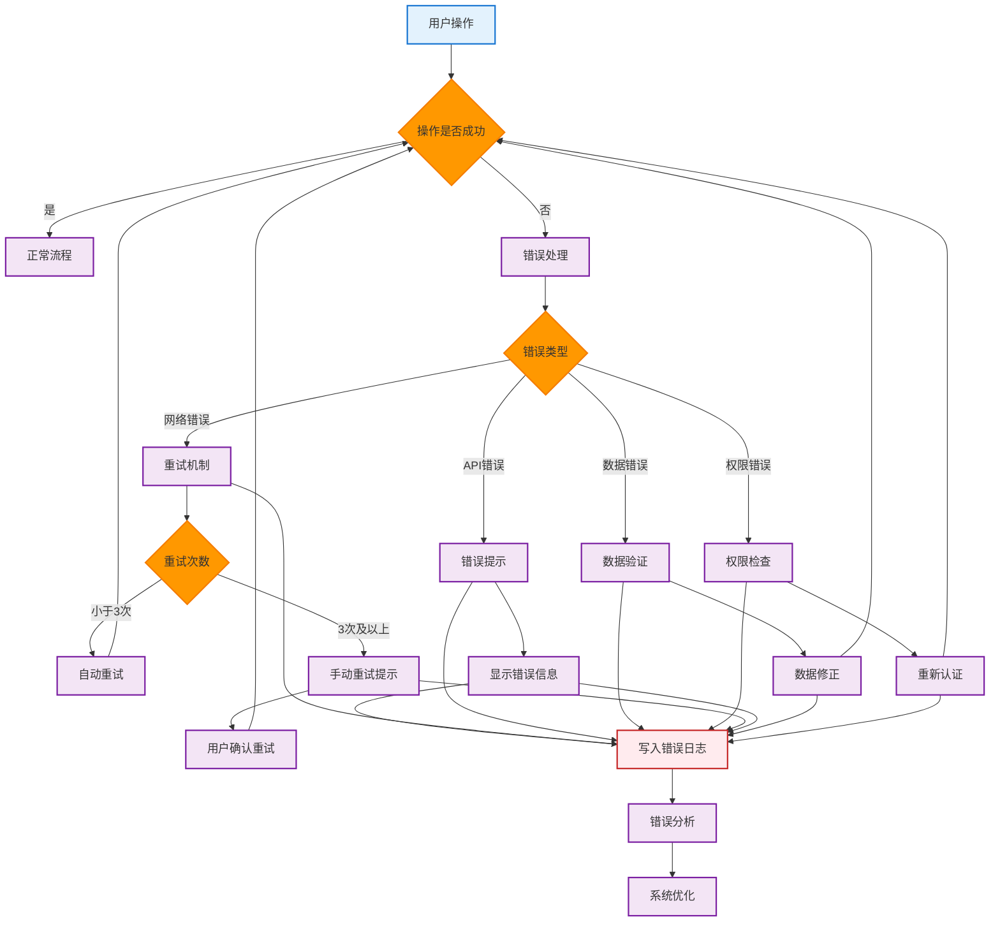

# Interview Helper 系统完整流程图 (可导出版本)

## 系统概述

Interview Helper是一个AI驱动的面试陪练平台，支持语音和文本交互，提供个性化的面试反馈和改进建议。系统在现有功能基础上新增了针对考公面试的专门功能模块。

## 1. 系统整体架构图

## 2. 用户交互完整流程图

## 3. 考公面试智能体详细流程

## 4. 数据流架构图

## 5. 系统组件交互图

## 6. 面试流程状态图

## 7. 错误处理流程

## 导出说明

### 如何导出图片

1. **使用Mermaid Live Editor**:
   - 访问 https://mermaid.live/
   - 复制上述Mermaid代码到编辑器
   - 点击导出按钮，选择PNG、SVG或PDF格式

2. **使用VS Code**:
   - 安装Mermaid Preview插件
   - 在Markdown文件中查看预览
   - 右键选择导出图片

3. **使用在线工具**:
   - Mermaid Chart: https://www.mermaidchart.com/
   - 支持多种导出格式

### 推荐导出格式

- **PNG**: 适合网页展示和文档插入
- **SVG**: 适合网页，可缩放不失真
- **PDF**: 适合打印和正式文档

### 图片尺寸建议

- **系统架构图**: 1200x800px
- **流程图**: 1000x600px
- **状态图**: 800x600px

这些流程图包含了详细的文字描述和清晰的视觉结构，可以直接用于项目文档、演示文稿或技术规范中。 